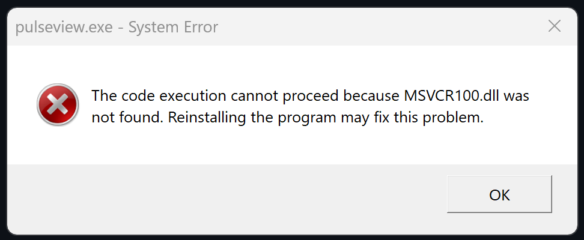

# PulseView-Win11
How to get pulseview working on Windows 11



If you get a MSVR100.dll error when opening pulseview it is because is missning. You can install it using winget with this powershell command:

```
winget install --id=Microsoft.VCRedist.2010.x64  -e
```
